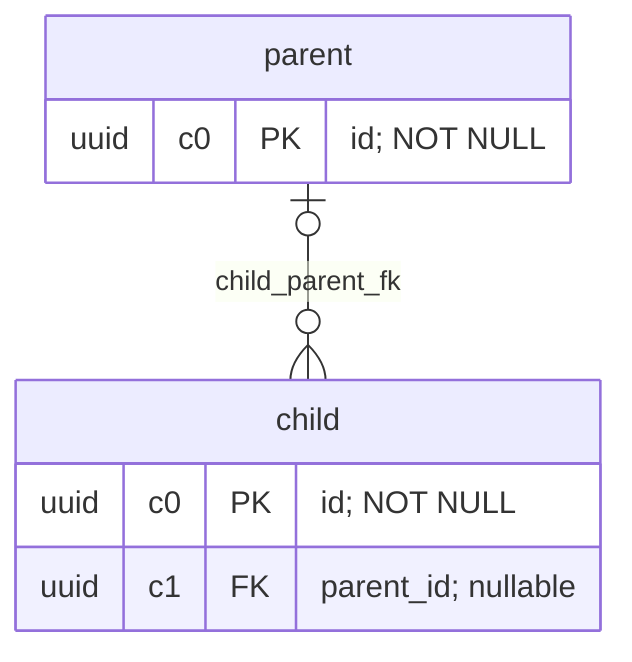

# PostgreSQL — relatório de evidências

Coleta: 2026-09-28T00:00:00Z; PostgreSQL: 170009; schema: public.
2 tabelas; 32768 bytes em relações, incluindo índices/TOAST. Não representa disco provisionado, WAL ou backups.

## Limites

Snapshot único; contadores acumulados não provam taxas ou causalidade. Sem workload, planos ou SLO, não há recomendação de capacidade nem economia comprovada.
Reset das estatísticas: None. track_counts: on.
Ausência de métricas não significa ausência de problemas. n_live_tup/n_dead_tup são estimativas, não medida de bloat.
DER contém FKs declaradas; relações não validadas podem ter linhas legadas inconsistentes. Índices parciais não definem cardinalidade global. Funções, views, triggers, RLS policies e corpos de CHECKs não são exportados.

## Pontos para revisão (nenhuma mudança aplicada)

- **review-fk-index — child_parent_fk**: No full valid B-tree with these FK columns as leading keys found. Candidate only: inspect plans, parent deletes/updates, other index methods, table size and write cost.

## Tabelas

| Tabela | Bytes totais | Bytes índices | Vivas estimadas | Mortas estimadas |
| --- | ---: | ---: | ---: | ---: |
| parent | 16384 | 8192 | 0 | 0 |
| child | 16384 | 8192 | 0 | 0 |

## DER implementado

## Próxima decisão

Para cada candidato: hipótese, consulta/janela representativa, evidência, confiança, alternativa, custo de escrita, validação e rollback. Consultar workflows do pacote antes de propor mudanças.
